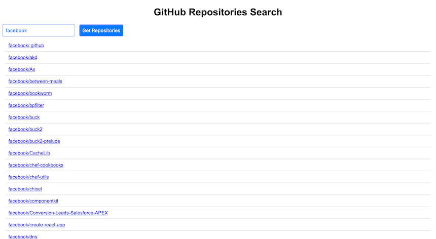

# AJAX Quiz

## Description

Use the GitHub API to list all repositories for a given user. You're asked to use the following endpoint:
```
https://api.github.com/users/{username}/repos
```

#### Example:
[https://api.github.com/users/facebook/repos](https://api.github.com/users/facebook/repos)

## Submission Instructions
1. Accept the assignment (the link will be shared on Teams).
2. Open the source code in your [CodeSandbox](https://codesandbox.io) by importing your cloned repo from GitHub into CodeSandbox.
3. Complete the code in `script.js`
 - You'll need to show a list of repositories for the given user as shown below:
   

 - Example:
    ```html
    <ul>
        <li><a href="link to repo">Repo name</a></li>
        <li><a href="link to repo">Repo name</a></li>
        <li><a href="link to repo">Repo name</a></li>
    </ul>
    ```

4. Run `npm test` to check if your code is correct.
4. Click on commit to commit your code to GitHub


## Usage

```shell
npm i
npm start
```


